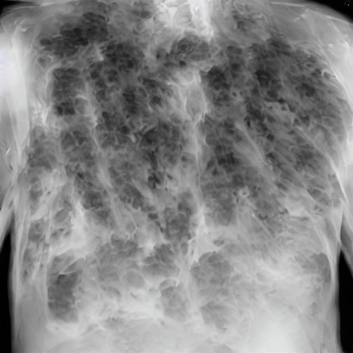

# Synthetic Multimodal Data Generation
---
## Approach
* Text-to-text, text-to-image
* GPT2 model for text-to-text
## Related work
Pre-trained model
[GPT2-SIMPLE](https://github.com/minimaxir/gpt-2-simple )
[AI-GEN](https://github.com/minimaxir/aitextgen)
## Performace Evaluate
- Loss function
- Preplexity
  - math.exp(loss/ len(token_input))
- BLEU
  - Rely on the prefix input and origin text
- the following paper indicate that lower preplexity has better performance
  - [Latent Dirichlet Allocation](https://www.jmlr.org/papers/volume3/blei03a/blei03a.pdf)
## Downloadable file
- [gpt2.tar.gz](https://drive.google.com/file/d/1JPQ7dFMJiJIRYIJliy5qzGawOewuVnUn/view?usp=sharing)  
## Text-to-image 
---  
### Dataset
 -[Original Labeled dataset](https://github.com/SuperSupermoon/MedViLL)  
 -[prepare_data](/explorations/data.ipynb)
  - 'under exploration/data.ipynb'
---  
- [Stable Diffusion text-to-image fine-tuning huggingface](https://github.com/huggingface/diffusers/tree/main/examples/text_to_image)  
- [Shareable link hub](https://jh-homayouni.nrp-nautilus.io/hub/user-redirect/lab/tree/text_to_img/diffusers/examples/text_to_image/sd-pokemon-model-lora)  
---
- Training time around 53-mins with the following hyperparameters
  ```
  export MODEL_NAME="CompVis/stable-diffusion-v1-4"
  export dataset_name="/home/jovyan/text_to_img/img_data/train/xray"
  accelerate launch --mixed_precision="fp16" train_text_to_image_lora.py \
    --pretrained_model_name_or_path=$MODEL_NAME \
    --dataset_name=$dataset_name --caption_column="additional_feature" \
    --resolution=128 --random_flip \
    --train_batch_size=1 \
    --num_train_epochs=3 --checkpointing_steps=5000 \
    --learning_rate=1e-04 --lr_scheduler="constant" --lr_warmup_steps=0 \
    --seed=42 \
    --output_dir="sd-pokemon-model-lora"
  ```
- Gnerating Result
  ```Python
  from diffusers import StableDiffusionPipeline
  import torch

  model_path = "/home/jovyan/text_to_img/diffusers/examples/text_to_image/sd-pokemon-model-lora"
  pipe = StableDiffusionPipeline.from_pretrained("CompVis/stable-diffusion-v1-4", torch_dtype=torch.float16)
  pipe.unet.load_attn_procs(model_path)
  pipe.to("cuda")

  prompt = "the chest xray"
  image = pipe(prompt, num_inference_steps=30, guidance_scale=7.5).images[0]
  image.save("pokemon.png")
  ```
- Result
    - 
---
## Existing Issue
- result is not accurate
- training time extremely long
- it requires more powerful GPU/CPU to boots
- requires more powerful GPU/CPU boost training time
## Relate paper
- [] TODO